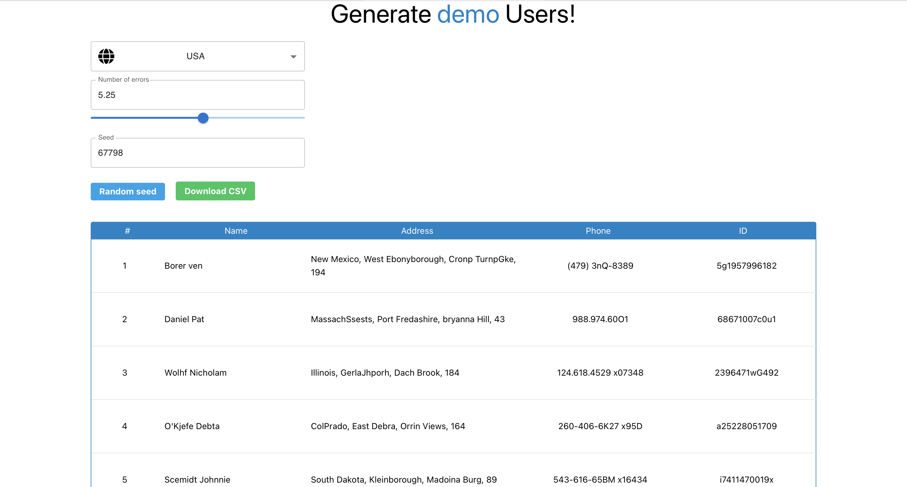

# Fake users
This is a web-app for the fake (random) user data generation. This app allows to select region (RUS, USA, PL), to specify the number of errors in row, to define seed value. Also it is possible to export data to CSV file.

You can view the deployed site [here](https://fake-users-088w.onrender.com)

## Stack
* typescript
* react
* fakerator
* tailwind
* react-window-infinite-loader
